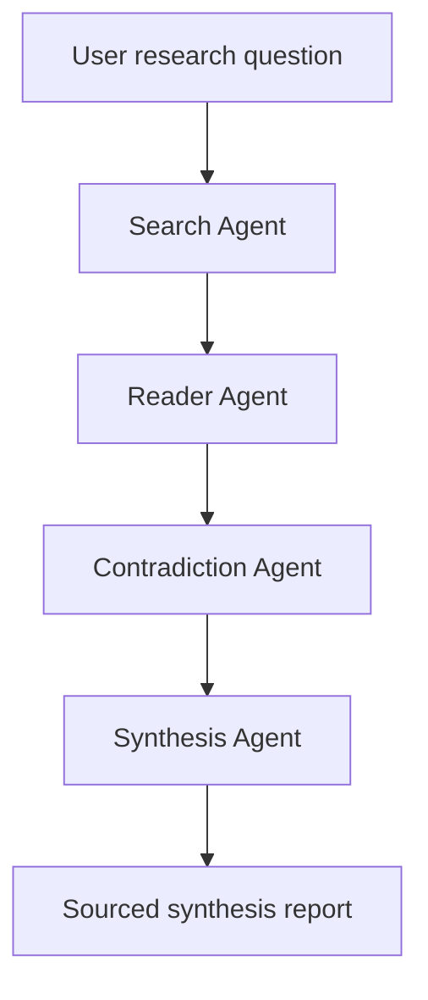

# Research Synthesizer

Research Synthesizer is a multi-agent AI backend that turns a research question into a sourced synthesis report.

It is built as an Agentic AI / AI Backend portfolio project: the goal is to demonstrate LangGraph orchestration, structured LLM outputs, parallel research processing, API design, observability readiness, and production-minded engineering practices.

## What It Does

Given a question such as:

```text
How can hallucination be reduced in RAG systems?
```

the system runs a research pipeline:

1. Finds relevant academic and technical sources.
2. Summarizes each source into structured fields.
3. Extracts claims, methods, findings, and confidence scores.
4. Detects contradictions and consensus gaps.
5. Produces a final synthesis report with sources.

## Demo API Flow

Start the API:

```bash
source .venv/bin/activate
python main.py
```

Health check:

```bash
curl http://127.0.0.1:8000/health
```

Expected response:

```json
{"status":"ok"}
```

Run a research request:

```bash
curl -X POST http://127.0.0.1:8000/research \
  -H "Content-Type: application/json" \
  -d '{"question":"How to reduce hallucination in RAG systems?"}'
```

Example response shape:

```json
{
  "session_id": "5ff97445-019f-4fb5-a755-14560ac54b72",
  "question": "How to reduce hallucination in RAG systems?",
  "summary": "The current research suggests that retrieval quality, source reliability, and grounding generation in external evidence are key factors in reducing hallucination in RAG systems...",
  "contradictions": [
    "Some approaches claim retrieval alone is sufficient, while others show that retrieval quality and answer verification are both needed."
  ],
  "open_questions": [
    "How should retrieval strategies be adapted across domains?",
    "How can source quality be measured automatically?"
  ],
  "sources": [
    "https://arxiv.org/...",
    "https://ieeexplore.ieee.org/..."
  ]
}
```

Output content depends on search results and LLM responses, but the API contract stays stable through Pydantic models and FastAPI response schemas.

## Architecture



### Agent Responsibilities

- `Search Agent`: retrieves academic and technical sources.
- `Reader Agent`: summarizes papers into structured `PaperSummary` objects.
- `Contradiction Agent`: identifies contradictions, consensus points, and open questions.
- `Synthesis Agent`: generates the final `SynthesisReport`.

## Tech Stack

- Python
- FastAPI
- LangGraph
- LangChain
- Groq
- Tavily
- Pydantic
- Langfuse
- pytest
- Docker

## Why This Project Matters

Most simple LLM demos return a single generated answer. This project is designed as a backend workflow:

- It separates work into specialized agents.
- It uses typed state and structured outputs instead of raw text parsing.
- It keeps heavy LLM/search clients out of API startup through lazy loading.
- It exposes the workflow through a tested FastAPI boundary.
- It is prepared for observability with Langfuse tracing.

## Current Status

Implemented:

- FastAPI API with `/health` and `/research`
- LangGraph pipeline foundation
- Pydantic models for structured agent output
- Lazy initialization for Groq, Tavily, LangChain, and Langfuse
- Centralized environment config
- Controlled API error handling
- API regression tests
- Docker and Docker Compose files
- GitHub-ready README and setup instructions

Next improvements:

- Claim-level evidence grounding
- Source deduplication and ranking
- Semantic Scholar and arXiv provider abstraction
- Contradiction matrix with source-to-source comparison
- Evaluation metrics for grounded claim quality
- Async job API for long-running research tasks
- Streamlit demo UI

## Setup

Create and activate a virtual environment:

```bash
python3 -m venv .venv
source .venv/bin/activate
```

Install pinned dependencies:

```bash
python -m pip install -r requirements.txt
```

Create your local environment file:

```bash
cp .env.example .env
```

Add your API keys:

```env
GROQ_API_KEY=...
TAVILY_API_KEY=...
```

## Configuration

Common environment variables:

```env
HOST=127.0.0.1
PORT=8000
UVICORN_RELOAD=false

LANGFUSE_ENABLED=false
LANGFUSE_PUBLIC_KEY=
LANGFUSE_SECRET_KEY=
LANGFUSE_HOST=
```

Langfuse is disabled by default for local development. Enable it with:

```env
LANGFUSE_ENABLED=true
```

## Run Tests

```bash
source .venv/bin/activate
python -m pytest
```

Current API tests cover:

- health check
- blank question validation
- successful response mapping
- missing synthesis report handling
- configuration error handling

## Docker

Build and run with Docker Compose:

```bash
docker compose up --build
```

The Docker Compose setup binds the API to `0.0.0.0` inside the container and exposes it on port `8000`.

## Engineering Notes

- API startup is intentionally lightweight.
- Expensive clients are created only when a research request needs them.
- `.env` is ignored by Git; use `.env.example` as the template.
- The project is currently a working backend foundation, not a production research accuracy benchmark yet.

## Portfolio Summary

Designed a multi-agent research synthesis backend using LangGraph, FastAPI, Groq, Tavily, Pydantic structured outputs, and Langfuse-ready observability to retrieve academic sources, extract structured paper summaries, detect contradictions, and generate sourced synthesis reports.
